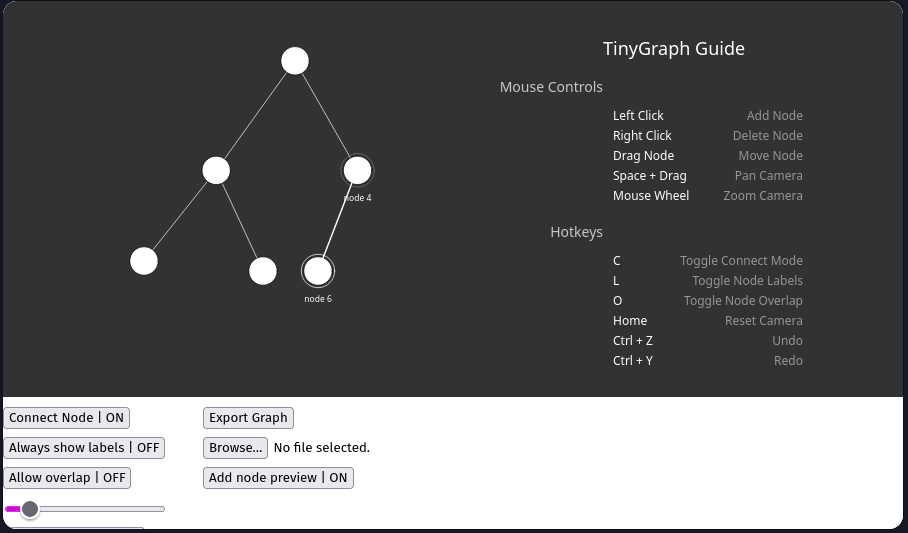

# TinyGraph

TinyGraph is a lightweight, interactive graph visualization tool built with p5.js. It allows users to create, manipulate, and visualize graph structures directly in the browser, complete with physics-based interactions and a full suite of editing tools.

  

## Features

-   **Interactive Canvas:** Create, select, connect, and delete nodes with simple mouse clicks.
-   **Physics Engine:** Nodes dynamically "jiggle" and repel each other for clear visualization.
-   **Camera Controls:** Pan and zoom the canvas to navigate large graphs with ease.
-   **Full History Management:** Unlimited undo/redo support for all actions.
-   **Save & Load:** Export your graph to a JSON file and load it back into the application at any time.
-   **Customizable View:** Toggle node labels, node overlap, canvas boundaries, and more.
-   **Responsive Design:** The canvas and UI adapt to your window size.
-   **Hotkeys:** A full suite of keyboard shortcuts for power users.

## Live Demo

**[Try TinyGraph live here!](https://l4xp.github.io/tiny-graph/)**
*(Suggestion: Host your project on GitHub Pages and link to it here)*

## Usage Guide

### Mouse Controls

| Action             | Description                            |
| ------------------ | -------------------------------------- |
| **Left Click**     | Add a new node at the cursor position. |
| **Right Click**    | Delete the hovered node.               |
| **Drag Node**      | Click and drag a node to move it.      |
| **`Space` + Drag** | Pan the camera across the canvas.      |
| **Mouse Wheel**    | Zoom the camera in and out.            |

### Keyboard Shortcuts

| Hotkey        | Description                         |
| ------------- | ----------------------------------- |
| **`C`**       | Toggle "Connect Mode" to add edges. |
| **`L`**       | Toggle visibility of all node labels. |
| **`O`**       | Toggle whether nodes can overlap.     |
| **`Home`**    | Reset the camera's zoom and position. |
| **`Ctrl`+`Z`**  | Undo the last action.               |
| **`Ctrl`+`Y`**  | Redo the last undone action.        |

## Future Development (TODO)

This project is under development. Future planned features include:

-   **Graph Representations:** Display the graph as an adjacency list/matrix, edge list, etc.
-   **Graph Properties:** Support for directed/undirected edges and edge weights.
-   **Algorithm Visualizers:** Interactively visualize graph traversal (BFS, DFS) and pathfinding algorithms.
-   **Interactive Inspector:** A panel to view and edit the properties (label, color, speed) of a selected node.
-   **Physics Toggle:** A "calm mode" to disable all physics-based movement.

## Built With

-   [p5.js](https://p5js.org/) - A JavaScript library for creative coding.
